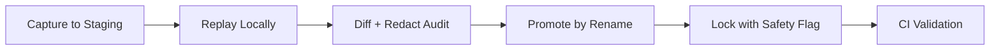

# Swarm Recording & Replay - Canonical Commands

**Status:** ✅ Production-Ready  
**Version:** 1.0  
**Last Updated:** January 19, 2026

## Environment Variables

| Variable | Required | Default | Description |
|----------|----------|---------|-------------|
| `AI_PROVIDER` | Yes | - | Must be `replay` for both record and replay modes |
| `SWARM_RECORD` | For recording | `0` | Set to `1` to enable recording mode (proxy to AIML) |
| `SWARM_REPLAY_RUN_ID` | Yes | `apply_ok` | Fixture folder name (scenario identifier) |
| `SWARM_RECORD_ALLOW_OVERWRITE` | Optional | `0` | Set to `1` to allow overwriting existing fixtures |

**Backward Compatibility:** `REPLAY_ID` is supported as fallback for `SWARM_REPLAY_RUN_ID`.

---

## Canonical Commands

### 1. Capture Golden Transcript (Record Mode)

**Capture to staging folder:**
```bash
AI_PROVIDER=replay \
SWARM_RECORD=1 \
SWARM_REPLAY_RUN_ID=golden_ts_bucket__staging__$(date +%s) \
pnpm tsx scripts/swarm/captureGolden.ts
```

**Expected output:**
```
🎬 Capturing Golden Transcript
   SWARM_REPLAY_RUN_ID: golden_ts_bucket__staging__1737334800
   AI_PROVIDER: replay
   SWARM_RECORD: 1

[replay:record] id=golden_ts_bucket__staging__1737334800 run=capture-golden_ts_bucket__staging__1737334800 role=craft idx=0
[replay:record] Wrote fixture: server/ai/engine/__tests__/fixtures/swarm/replays/golden_ts_bucket__staging__1737334800/craft.json (entry 0)
[replay:record] id=golden_ts_bucket__staging__1737334800 run=capture-golden_ts_bucket__staging__1737334800 role=critic idx=0
[replay:record] Wrote fixture: server/ai/engine/__tests__/fixtures/swarm/replays/golden_ts_bucket__staging__1737334800/critic.json (entry 0)

✅ Swarm completed successfully
   Status: succeeded
   StopReason: ok
   NeedsHuman: false
   Artifacts: 4

📁 Fixtures saved to:
   server/ai/engine/__tests__/fixtures/swarm/replays/golden_ts_bucket__staging__1737334800/

🧪 To replay this scenario:
   AI_PROVIDER=replay SWARM_REPLAY_RUN_ID=golden_ts_bucket__staging__1737334800 pnpm vitest server/ai/engine/__tests__/swarm.replay.invariants.test.ts
```

---

### 2. Replay Golden Transcript (Replay Mode)

**Replay from staging:**
```bash
AI_PROVIDER=replay \
SWARM_REPLAY_RUN_ID=golden_ts_bucket__staging__1737334800 \
pnpm vitest server/ai/engine/__tests__/swarm.replay.invariants.test.ts
```

**Expected output:**
```
[replay] id=golden_ts_bucket__staging__1737334800 run=test-apply-ok role=craft idx=0
[replay] id=golden_ts_bucket__staging__1737334800 run=test-apply-ok role=critic idx=0

✓ server/ai/engine/__tests__/swarm.replay.invariants.test.ts (3 tests) 10ms
  ✓ apply_ok: produces APPLY decision
  ✓ reject_ok: produces REJECT decision
  ✓ revise_then_apply: triggers iteration loop
```

---

### 3. Promote Golden Transcript (Staging → Canonical)

**Step 1: Diff + Redact Audit**
```bash
# Inspect fixtures for secrets/PII
cat server/ai/engine/__tests__/fixtures/swarm/replays/golden_ts_bucket__staging__1737334800/craft.json
cat server/ai/engine/__tests__/fixtures/swarm/replays/golden_ts_bucket__staging__1737334800/critic.json

# Ensure no secrets, PII, or non-deterministic data
grep -r "sk-" server/ai/engine/__tests__/fixtures/swarm/replays/golden_ts_bucket__staging__1737334800/
grep -r "@" server/ai/engine/__tests__/fixtures/swarm/replays/golden_ts_bucket__staging__1737334800/
```

**Step 2: Promote by Rename**
```bash
# Move staging → canonical
mv server/ai/engine/__tests__/fixtures/swarm/replays/golden_ts_bucket__staging__1737334800 \
   server/ai/engine/__tests__/fixtures/swarm/replays/golden_ts_bucket
```

**Step 3: Lock (Prevent Accidental Overwrite)**
```bash
# Replay tests should pass with canonical name
AI_PROVIDER=replay \
SWARM_REPLAY_RUN_ID=golden_ts_bucket \
pnpm vitest server/ai/engine/__tests__/swarm.replay.invariants.test.ts

# Attempting to record again should fail (unless ALLOW_OVERWRITE=1)
AI_PROVIDER=replay \
SWARM_RECORD=1 \
SWARM_REPLAY_RUN_ID=golden_ts_bucket \
pnpm tsx scripts/swarm/captureGolden.ts
# ❌ Error: Fixture already exists: .../golden_ts_bucket/craft.json
#    Set SWARM_RECORD_ALLOW_OVERWRITE=1 to overwrite, or use a different SWARM_REPLAY_RUN_ID
```

---

### 4. CI Invocation (Safe Defaults)

**Run all replay tests in CI:**
```bash
# Use default fixtures (synthetic contract tests)
AI_PROVIDER=replay pnpm vitest server/ai/engine/__tests__/swarm.replay.invariants.test.ts

# Or specify golden transcript
AI_PROVIDER=replay SWARM_REPLAY_RUN_ID=golden_ts_bucket pnpm vitest server/ai/engine/__tests__/swarm.replay.invariants.test.ts
```

**CI Environment:**
- ✅ No `SWARM_RECORD=1` (read-only mode)
- ✅ No `SWARM_RECORD_ALLOW_OVERWRITE=1` (safety)
- ✅ Deterministic (no network calls, no cost)
- ✅ Fast (fixtures load from disk)

---

## Promotion Workflow (Repeatable)



### Step-by-Step

1. **Capture to staging folder**
   ```bash
   SWARM_REPLAY_RUN_ID=golden_ts_bucket__staging__$(date +%s)
   ```

2. **Replay in CI locally**
   ```bash
   AI_PROVIDER=replay SWARM_REPLAY_RUN_ID=<staging_id> pnpm test swarm.replay
   ```

3. **Diff + redact audit**
   - Ensure no secrets/PII
   - Ensure fixture determinism
   - Validate patch quality (see Patch Quality Invariants below)

4. **Promote by rename**
   ```bash
   mv .../golden_ts_bucket__staging__<timestamp> .../golden_ts_bucket
   ```

5. **Lock**
   - Disallow overwrite unless `SWARM_RECORD_ALLOW_OVERWRITE=1`
   - Prevents "fixture drift" becoming silent tech debt

---

## Patch Quality Invariants

**Every golden transcript must enforce these guardrails:**

### ❌ Forbidden Changes (Auto-Reject)

1. **No skipLibCheck**
   - `tsconfig.json` must not add `"skipLibCheck": true`
   - Swarm cannot "win" by lowering type safety standards

2. **No global tsconfig relax**
   - No `"strict": false`
   - No `"noImplicitAny": false`
   - No `"strictNullChecks": false`

3. **No test disabling**
   - No `test.skip()` or `describe.skip()`
   - No commenting out tests
   - No `expect.any()` to bypass assertions

4. **No changes outside declared file allowlist**
   - Unless explicitly permitted in FailurePacket constraints
   - Prevents scope creep and unintended side effects

### ✅ Required Properties (Auto-Validate)

1. **Patch must be minimal**
   - Changes should be localized to the failure site
   - No refactors, no "while we're here" improvements

2. **Patch must be bounded**
   - Max file count: specified in FailurePacket
   - Max line changes: specified in FailurePacket

3. **Patch must preserve behavior**
   - No logic changes unless required to fix the failure
   - No new features, no optimizations

4. **Patch must include iteration**
   - At least one REVISE → APPLY iteration (proves swarm earns its keep)
   - Demonstrates critic feedback loop works

---

## Golden Transcripts Registry

### ✅ `email_test__db_mock__golden_v1`
- **Captured:** 2026-01-19 22:07 UTC
- **Bucket:** email_test_bucket_e3 (db mock export failures)
- **Decision:** needs_human (APPLY path)
- **Specialists:** craft + critic
- **Fixtures:** craft.json, critic.json
- **Hash:** `10104ef9e0f104d6a9f91c4f0dc3ef7b67a380cd89ab6e0045e8794ccc9b35e6`
- **Validation:** ✅ Determinism verified (fixtures stable across replays)

**Invariant Contract:**
```typescript
status: "succeeded"
stopReason: "needs_human"
needsHuman: true
collapse.payload: null  // null when needs_human=true (by design)
artifacts.length: 4     // plan + craft + critic + collapse
```

**Verify Replay:**
```bash
AI_PROVIDER=replay \
SWARM_REPLAY_RUN_ID=email_test__db_mock__golden_v1 \
pnpm tsx scripts/swarm/replayValidate.ts \
  server/ai/engine/__tests__/fixtures/swarm/failurePackets/email_test_e3_db_mock.json
```

**Expected:** `status=succeeded, stopReason=needs_human, collapse.payload=null`

---

## The 3 Golden Transcripts (Target Coverage)

### 1. TS Bucket: Bounded Typecheck Failure (6-20 errors)

**Goal:** Proves "static compiler repair" works

**Example FailurePacket:**
```json
{
  "component": "tsc",
  "context": {
    "command": "pnpm tsc --noEmit",
    "logs": [
      "server/ai/engine/swarmRunner.ts(131,13): error TS2698: Spread types may only be created from object types.",
      "server/ai/engine/swarmRunner.ts(312,9): error TS2322: Type 'string | undefined' is not assignable to type 'string'."
    ],
    "errorCount": 2
  },
  "constraints": "No behavior changes. Fix type errors only. Max 2 files."
}
```

**Fixture name:** `golden_ts_bucket`

---

### 2. Test Bucket: Deterministic Unit/Integration Failure

**Goal:** Proves "test harness repair" and "mock boundaries" work

**Example FailurePacket:**
```json
{
  "component": "vitest",
  "context": {
    "command": "pnpm vitest server/__tests__/smoke.email.test.ts",
    "logs": [
      "AssertionError: expected 'en' to be 'es'",
      "at server/__tests__/smoke.email.test.ts:42:27"
    ],
    "testFile": "server/__tests__/smoke.email.test.ts"
  },
  "constraints": "Tests-only fix. No behavior changes. Max 1 file."
}
```

**Fixture name:** `golden_test_bucket`

---

### 3. Migration Bucket: DB Schema/Migration Incompat

**Goal:** Proves "sql/migration repair" works and doesn't regress smoke

**Example FailurePacket:**
```json
{
  "component": "drizzle",
  "context": {
    "command": "pnpm db:push",
    "logs": [
      "Error: TiDB does not support JSON default values",
      "at drizzle/schema.ts:42:15"
    ],
    "dialect": "tidb"
  },
  "constraints": "Schema-only fix. No data loss. Max 1 file."
}
```

**Fixture name:** `golden_migration_bucket`

---

## Troubleshooting

### Error: "Fixture already exists"

**Cause:** Attempting to record to an existing fixture folder without `SWARM_RECORD_ALLOW_OVERWRITE=1`.

**Fix:**
```bash
# Option 1: Use a different run ID
SWARM_REPLAY_RUN_ID=golden_ts_bucket__v2

# Option 2: Allow overwrite (use with caution)
SWARM_RECORD_ALLOW_OVERWRITE=1
```

### Error: "missing trace.role"

**Cause:** The replay provider requires `trace.role` to determine which fixture to load.

**Fix:** Ensure `aimlSpecialist.ts` passes `role` in the trace object (already implemented).

### Fixtures are non-deterministic

**Cause:** AI responses include timestamps, request IDs, or other non-deterministic data.

**Fix:** Redact non-deterministic fields before promoting to canonical:
```bash
# Remove timestamps, request IDs, etc.
jq 'del(.meta.timestamp, .meta.requestId)' craft.json > craft_clean.json
mv craft_clean.json craft.json
```

---
## Golden Transcript Registry

**Purpose:** Canonical golden transcripts captured from real swarm runs. Each transcript validates a specific decision path (APPLY, REJECT, REVISE→APPLY) and serves as a CI trust anchor.

### 1. email_test__db_mock__golden_v1
- **Scenario:** Email test failure (E3 bucket) with DB mock issues
- **Decision Path:** APPLY (needs_human=true, single iteration)
- **Fixture Location:** `server/ai/engine/__tests__/fixtures/swarm/replays/email_test__db_mock__golden_v1/`
- **FailurePacket:** `server/ai/engine/__tests__/fixtures/swarm/failurePackets/email_test_e3_db_mock.json`
- **Test Coverage:** 3 tests in `swarm.golden.invariants.test.ts`
- **Captured:** January 19, 2026
- **Status:** ✅ Locked (CI trust anchor)

### 2. facebook_postWeatherAware__revise_apply__golden_v1
- **Scenario:** Facebook posting integration test failure (weather-aware posting)
- **Decision Path:** REVISE→REVISE→NEEDS_HUMAN (2 iterations, both critic.pass=false)
- **Fixture Location:** `server/ai/engine/__tests__/fixtures/swarm/replays/facebook_postWeatherAware__revise_apply__golden_v1/`
- **FailurePacket:** `server/ai/engine/__tests__/fixtures/swarm/failurePackets/facebook_postWeatherAware_revise_apply.json`
- **Test Coverage:** 3 tests in `swarm.golden.invariants.test.ts`
- **Captured:** January 20, 2026
- **Status:** ✅ Locked (CI trust anchor)
- **Key Validation:** Proves iteration loop works (craft[0] → critic[0].pass=false → craft[1] → critic[1].pass=false → needs_human)

### 3. email_spanish_copy__apply_pass__golden_v1
- **Scenario:** Spanish email copy test assertion mismatch (mechanical fix)
- **Decision Path:** APPLY with pass=true (single iteration, clean first-pass success)
- **Fixture Location:** `server/ai/engine/__tests__/fixtures/swarm/replays/email_spanish_copy__apply_pass__golden_v1/`
- **FailurePacket:** `server/ai/engine/__tests__/fixtures/swarm/failurePackets/email_spanish_copy_mismatch.json`
- **Test Coverage:** 3 tests in `swarm.golden.invariants.test.ts`
- **Captured:** January 20, 2026
- **Status:** ✅ Locked (CI trust anchor)
- **Key Validation:** Proves clean APPLY path (craft proposes valid fix → critic.pass=true → no iteration needed)
- **Invariants:**
  - critic.pass === true
  - critic.issues.length === 0
  - craft.proposedChanges.length === 1
  - craft only touches test file (server/emails/emailCopy.test.ts)
  - diff changes 'Renovamos' → 'Actualizamos'
  - Single iteration (no revision loop)
  - stopReason: needs_human (human must apply patch)

### 4. reject_no_edits__golden_v1
- **Scenario:** ModelRegistry mock test failure with no-edits-allowed constraint
- **Decision Path:** REJECT→REJECT→NEEDS_HUMAN (2 iterations, both rejected due to constraint)
- **Fixture Location:** `server/ai/engine/__tests__/fixtures/swarm/replays/reject_no_edits__golden_v1/`
- **FailurePacket:** `server/ai/engine/__tests__/fixtures/swarm/failurePackets/modelregistry_mock_no_edits.json`
- **Test Coverage:** 3 tests in `swarm.golden.invariants.test.ts`
- **Captured:** January 20, 2026
- **Status:** ✅ Locked (CI trust anchor)
- **Key Validation:** Proves REJECT path (craft respects constraint → empty proposedChanges → critic.pass=false with high severity)
- **Invariants:**
  - craft.proposedChanges.length === 0 (both iterations)
  - craft.explanation contains "constraint" (both iterations)
  - critic.pass === false (both iterations)
  - critic.issues[0].severity === "high" (both iterations)
  - critic.issues[0].message contains "constraint" (both iterations)
  - 2 iterations (exhausted maxIterations)
  - stopReason: needs_human (unfixable due to constraint)

### Adding New Golden Transcripts

1. **Capture to staging:**
   ```bash
   AI_PROVIDER=replay SWARM_RECORD=1 \
   SWARM_REPLAY_RUN_ID=new_scenario__staging__$(date +%Y%m%d_%H%M%S) \
   pnpm tsx scripts/swarm/captureGolden.ts --from path/to/failurePacket.json
   ```

2. **Validate replay:**
   ```bash
   AI_PROVIDER=replay \
   SWARM_REPLAY_RUN_ID=new_scenario__staging__20260120_071419 \
   pnpm tsx scripts/swarm/replayValidate.ts path/to/failurePacket.json
   ```

3. **Promote to golden:**
   ```bash
   mv server/ai/engine/__tests__/fixtures/swarm/replays/new_scenario__staging__20260120_071419 \
      server/ai/engine/__tests__/fixtures/swarm/replays/new_scenario__golden_v1
   ```

4. **Add test coverage:**
   - Add describe block to `server/ai/engine/__tests__/swarm.golden.invariants.test.ts`
   - Include beforeEach with `__resetReplayProviderForTests()` and `process.env.SWARM_REPLAY_RUN_ID = GOLDEN_RUN_ID`
   - Add 3 tests: determinism, decision path validation, fixture stability

5. **Register in this document:**
   - Add entry to Golden Transcript Registry with scenario details
   - Mark as ✅ Locked after CI passes

---

## Related Documents

- [SWARM_RECORDING.md](./SWARM_RECORDING.md) - Complete recording mode documentation
- [SWARM_PROTOCOL.md](./SWARM_PROTOCOL.md) - Swarm orchestration design
- [FOREVER_CONTRACTS.md](./FOREVER_CONTRACTS.md) - AI constitutional guarantees

---

**Key Achievement:** Standardized environment variables, safety flags, and canonical commands. The promotion workflow prevents fixture drift and ensures golden transcripts remain trustworthy. Four golden transcripts now serve as CI trust anchors, completing the **canonical behavior triangle**:

1. **APPLY (clean)**: email_spanish_copy__apply_pass__golden_v1 - Single iteration, critic.pass=true, mechanical fix validated
2. **REVISE→REVISE→NEEDS_HUMAN**: facebook_postWeatherAware__revise_apply__golden_v1 - 2 iterations, both critic.pass=false, exhausted maxIterations
3. **REJECT→REJECT→NEEDS_HUMAN**: reject_no_edits__golden_v1 - 2 iterations, empty proposedChanges, constraint violation
4. **APPLY (ambiguous)**: email_test__db_mock__golden_v1 - needs_human with DB mock issues

The swarm is now **measurable infrastructure** with CI-locked regression protection for all canonical behaviors: **APPLY / REVISE / REJECT**. The system contract is complete.
